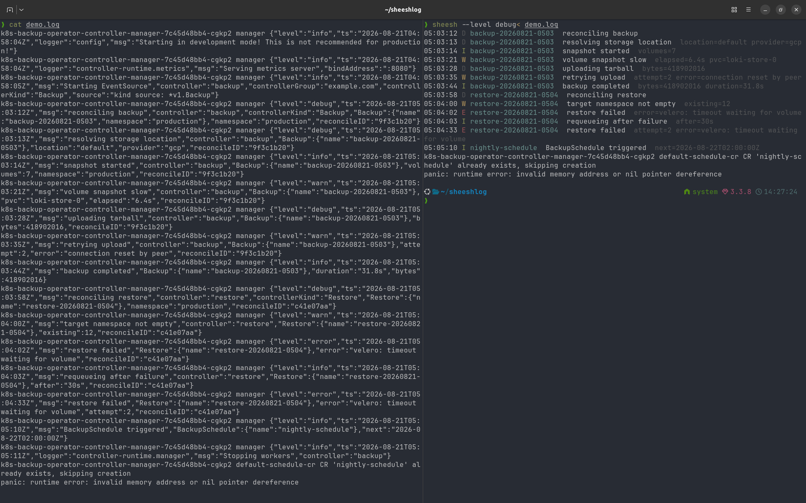

# sheeshlog

`sheesh` is a command-line tool that renders structured log lines into a compact,
human-readable form. It reads log lines on stdin and prints them using a named
**profile** — a recipe describing how one style of structured logging is read:
which fields carry the time, level, message and subject, which fields are context
that repeats on every line and so gets suppressed, and which lines are noise.

```sh
sheesh use operator                                      # once
kubectl logs -f deploy/backup-operator --prefix | sheesh
```



*Same 19 lines, twice. sheesh drops the startup noise, lifts the time, level
and subject out of the payload, suppresses the fields that repeat on every
line, and leaves the two lines it cannot parse exactly as they arrived.*

A profile says how to *read* a log style, never how the output looks: the layout
is fixed in code and identical for every profile. Lines that do not parse with the current profile
are passed through unchanged rather than dropped, so nothing goes missing.

## Install

```sh
go install github.com/meiserloh/sheeshlog/cmd/sheesh@latest
```

Or from a clone:

```sh
git clone https://github.com/meiserloh/sheeshlog
cd sheeshlog
go build -o sheesh ./cmd/sheesh
```

Building needs **Go 1.26 or newer** (see `go.mod`).

## Usage

```
<log source> | sheesh [flags]      render with the current profile
<pod's log> | sheesh --profile-for-pod <pod>
                                   render by pod name, ignoring the current
                                   profile; for a log viewer such as k9s
sheesh                             pick the current profile from a list
sheesh use <name>                  make a profile the current one
sheesh list                        print the profile names
sheesh check <name> < sample.log   report what a profile does to a sample
```

Run bare in a terminal, `sheesh` shows the picker: the profiles as a numbered
list, and the number you type becomes the current one. It is `use` without
having to remember the name.

`check` is the tool for writing a profile. Given a sample it reports how many
lines were rendered, passed through, dropped as noise or filtered by level,
which field filled each slot and how often, and which context fields were
suppressed — so an empty column is traceable to the path that missed rather
than guessed at:

```console
$ sheesh check operator < testdata/fixtures/operator.log
profile operator, threshold info
sample 6 lines: 1 passed through, 2 noise, 1 below info, 2 rendered

slots (of 3 lines reaching them)
  time     ts 3
  level    level 3
  message  msg 3
  subject  name 1, Backup.name 1, Restore.name 1, BackupSchedule.name 0
...
```

### Flags

The flags are about rendering. `use` and `list` accept none; `check` accepts
`--level`, because it reports what a render at that threshold would do.

|  | Description |
|---|---|
| `--level <trace\|debug\|info\|warn\|error>` | Minimum level to render. Default `info`. |
| `--color <auto\|always\|never>` | When to colour output. Default `auto` — colour when stdout is a terminal. |
| `--profile <name>` | Render this run with that profile, leaving the current one unchanged. |
| `--profile-for-pod <pod>` | Resolve the profile from a pod name, ignoring the remembered profile. With no profile for the pod the stream is passed through unread, and a note says so on stderr. |
| `--version` | Print the version and exit. |

### Environment

| Env-Var | Description |
|---|---|
| `LEVEL` | Minimum level, as `--level`. An explicit `--level` wins. |
| `NO_COLOR` | Set and non-empty disables colour, per [no-color.org](https://no-color.org). An explicit `--color` wins. |
| `XDG_CONFIG_HOME` | Where the configuration lives. Unset, it falls back to `~/.config`. |

## Profiles

Profiles are read from `$XDG_CONFIG_HOME/sheesh/profiles/`, falling back to
`~/.config/sheesh/profiles/` when `XDG_CONFIG_HOME` is unset. The directory does
not have to exist: sheesh writes an example profile there on its first run, and
renders with a built-in generic profile until you choose one.

**One example profile ships**, `operator` — a controller-runtime style. It is
there to be read and copied, not to cover your workloads; every profile beyond
it is one you write. That matters for two features in particular:
`--profile-for-pod` and the k9s plugin below both resolve a profile from the pod
name, so both do nothing useful until profiles named after your workloads exist.

Writing one: [docs/writing-a-profile.md](docs/writing-a-profile.md), which covers
the format, dotted paths, noise rules and how to use `check` while iterating.

## k9s

[contrib/k9s/plugin.yaml](contrib/k9s/plugin.yaml) adds a Shift-Z shortcut to the
pod and container views that opens the selected pod's logs already rendered by
the profile named after its workload. Merge its entries into
`~/.config/k9s/plugins.yaml`; the file's own comments cover the details.

It needs [`ov`](https://github.com/noborus/ov) on `PATH` as well as `sheesh` —
works better than for example `less`, because `less` cannot quit while following a pipe, so there are always multiple key presses necessary to return to k9s.

## Development

`go test ./...` runs the suite; how it is built, and the rule for regenerating
golden files: [docs/testing.md](docs/testing.md). Manual checks before a tag:
[docs/smoke-testing.md](docs/smoke-testing.md). Released versions are listed in
[CHANGELOG.md](CHANGELOG.md), and design decisions are recorded in
[docs/adr/](docs/adr).

## License

MIT — see [LICENSE](LICENSE).
